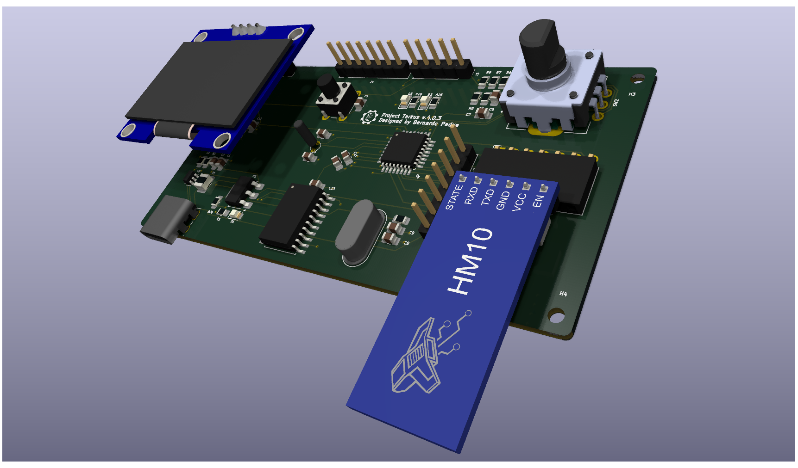

# Project Tarkus 🚀

## Overview
**Project Tarkus** is a custom development board designed for embedded systems study and prototyping, built around the **STM32G030K6T6** microcontroller.

The project started as a requirement for the **PBLE01** course at **UNIFEI**. The original specification required a 16x2 LCD and a temperature sensor. I decided to modernize the scope by replacing these with a **1.3" OLED Display** and a **Bluetooth LE module**, creating a more versatile platform for IoT projects.

## Key Features
* **Microcontroller:** STM32G030K6T6 (ARM Cortex-M0+, 32KB Flash, 8KB RAM).
* **Connectivity:**
    * **USB-C** for power and data.
    * **MCP2200** USB-to-UART Bridge for easy serial debugging.
    * **Bluetooth LE (HM-10)** interface for wireless communication.
* **User Interface:**
    * I2C header for **OLED Display** (SSD1306/SH1106).
    * **Rotary Encoder** with push-button for menu navigation.
    * 2x User LEDs.
* **Storage & RTC:** External I2C EEPROM (24LC512) and 32.768kHz Crystal for precise RTC.

## Design Decisions
One of the main challenges was the need for **two independent UART buses**: one for the Bluetooth module and another for the USB-Serial bridge. This requirement led to the selection of the **STM32G030K6**, which offers sufficient hardware UART peripherals, replacing the originally planned MCU.

## Repository Structure
* `Hardware/`: KiCad project files (Schematics, PCB Layout, Libraries).
* `Docs/`: Project documentation, schematics in PDF, and 3D renders.
* `Datasheets/`: Main components' technical documentation.

## Author
Designed by **Bernardo Lamim Fogaça de Padua**
*Institute of Systems Engineering and Information Technology - UNIFEI*
